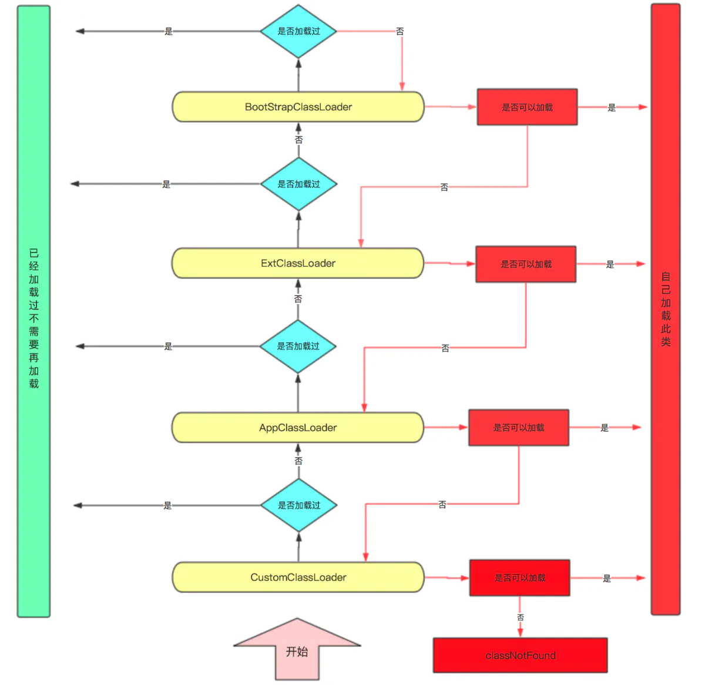

# JAVA 双亲委派模型

[TOP]

## 前言

平时做业务开发比较少接触类加载器，但是如果想深入学习Tomcat、Spring等开源项目，或者从事底层架构的开发，了解甚至熟悉类加载的原理是必不可少的。
java的类加载器有哪些？什么是双亲委派？为什么要双亲委派？如何打破它？多多少少对这些概念了解一些，甚至因为应付面试背过这些知识点，但是再深入一些细节，却知之甚少。

## 类加载器

类加载器，顾名思义就是一个可以将Java字节码加载为java.lang.Class实例的工具。这个过程包括，读取字节数组、验证、解析、初始化等。另外，它也可以加载资源，包括图像文件和配置文件。

类加载器的特点：

* 动态加载，无需在程序一开始运行的时候加载，而是在程序运行的过程中，动态按需加载，字节码的来源也很多，压缩包jar、war中，网络中，本地文件等。类加载器动态加载的特点为热部署，热加载做了有力支持。
* 全盘负责，当一个类加载器加载一个类时，这个类所依赖的、引用的其他所有类都由这个类加载器加载，除非在程序中显式地指定另外一个类加载器加载。所以破坏双亲委派不能破坏扩展类加载器以上的顺序。

一个类的唯一性由加载它的类加载器和这个类的本身决定（类的全限定名+类加载器的实例ID作为唯一标识）。比较两个类是否相等（包括Class对象的equals()、isAssignableFrom()、isInstance()
以及instanceof关键字等），只有在这两个类是由同一个类加载器加载的前提下才有意义，否则，即使这两个类来源于同一个Class文件，被同一个虚拟机加载，只要加载它们的类加载器不同，这两个类就必定不相等。

从实现方式上，类加载器可以分为两种：一种是启动类加载器，由C++语言实现，是虚拟机自身的一部分；另一种是继承于java.lang.ClassLoader的类加载器，包括扩展类加载器、应用程序类加载器以及自定义类加载器。

启动类加载器（Bootstrap ClassLoader）：负责加载<JAVA_HOME>
\lib目录中的，或者被-Xbootclasspath参数所指定的路径，并且是虚拟机识别的（仅按照文件名识别，如rt.jar，名字不符合的类库即使放在lib目录中也不会被加载）类库加载到虚拟机内存中。启动类加载器无法被Java程序直接引用，用户在编写自定义类加载器时，如果想设置Bootstrap
ClassLoader为其parent，可直接设置null。

扩展类加载器（Extension ClassLoader）：负责加载<JAVA_HOME>
\lib\ext目录中的，或者被java.ext.dirs系统变量所指定路径中的所有类库。该类加载器由sun.misc.Launcher$ExtClassLoader实现。扩展类加载器由启动类加载器加载，其父类加载器为启动类加载器，即parent=null。

应用程序类加载器（Application
ClassLoader）：负责加载用户类路径（ClassPath）上所指定的类库，由sun.misc.Launcher$App-ClassLoader实现。开发者可直接通过java.lang.ClassLoader中的getSystemClassLoader()
方法获取应用程序类加载器，所以也可称它为系统类加载器。应用程序类加载器也是启动类加载器加载的，但是它的父类加载器是扩展类加载器。在一个应用程序中，系统类加载器一般是默认类加载器。


## 双亲委派机制

### 什么是双亲委派

JVM
并不是在启动时就把所有的.class文件都加载一遍，而是程序在运行过程中用到了这个类才去加载。除了启动类加载器外，其他所有类加载器都需要继承抽象类ClassLoader，这个抽象类中定义了三个关键方法，理解清楚它们的作用和关系非常重要。

```java
public abstract class ClassLoader {
    // The parent class loader for delegation
    // Note: VM hardcoded the offset of this field, thus all new fields
    // must be added *after* it.
    //每个类加载器都有个父加载器
    private final ClassLoader parent;
    
    public Class<?> loadClass(String name) throws ClassNotFoundException {
        return loadClass(name, false);
    }
    
    protected Class<?> loadClass(String name, boolean resolve)
            throws ClassNotFoundException {
        synchronized (getClassLoadingLock(name)) {
            // First, check if the class has already been loaded
            //查找一下这个类是不是已经加载过了
            Class<?> c = findLoadedClass(name);

            //如果没有加载过
            if (c == null) {
                long t0 = System.nanoTime();
                try {
                    //先委派给父加载器去加载，注意这是个递归调用
                    if (parent != null) {
                        c = parent.loadClass(name, false);
                    } else {
                        // 如果父加载器为空，查找Bootstrap加载器是不是加载过了
                        c = findBootstrapClassOrNull(name);
                    }
                } catch (ClassNotFoundException e) {
                    // ClassNotFoundException thrown if class not found
                    // from the non-null parent class loader
                }

                if (c == null) {
                    // If still not found, then invoke findClass in order
                    // to find the class.
                    long t1 = System.nanoTime();
                    // 如果父加载器没加载成功，调用自己的findClass去加载
                    c = findClass(name);

                    // this is the defining class loader; record the stats
                    sun.misc.PerfCounter.getParentDelegationTime().addTime(t1 - t0);
                    sun.misc.PerfCounter.getFindClassTime().addElapsedTimeFrom(t1);
                    sun.misc.PerfCounter.getFindClasses().increment();
                }
            }
            if (resolve) {
                resolveClass(c);
            }
            return c;
        }
    }
    //查找一下这个类是不是已经加载过了
    protected final Class<?> findLoadedClass(String name) {
        if (!checkName(name)){
            return null;
        }
        return findLoadedClass0(name);
    }
    // 如果父加载器为空，查找Bootstrap加载器是不是加载过了
    private Class<?> findBootstrapClassOrNull(String name)
    {
        if (!checkName(name)) {
            return null;
        }
        return findBootstrapClass(name);
    }
    // 如果父加载器没加载成功，调用自己的findClass去加载
    protected Class<?> findClass(String name) throws ClassNotFoundException {
        throw new ClassNotFoundException(name);
    }

}
```